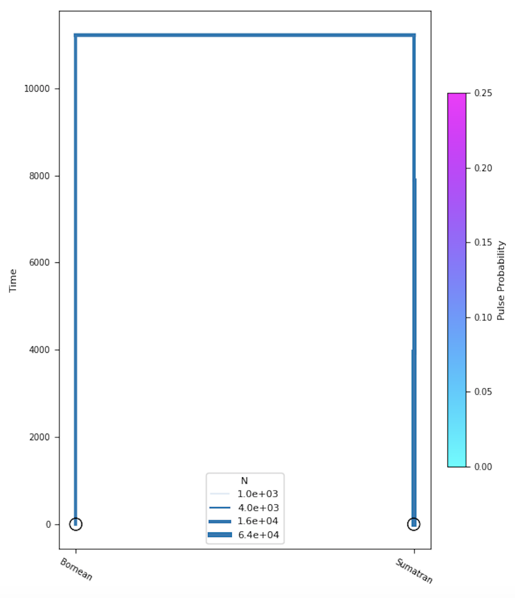
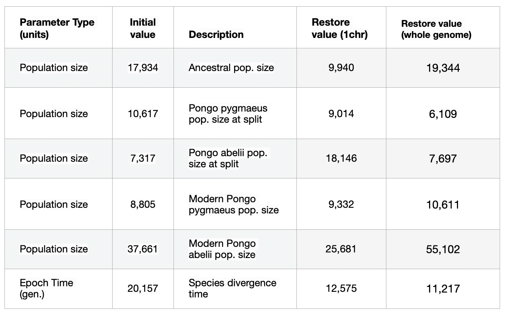

# Determining the effectiveness of momi2 for inferring demographic history in GADMA

The demographic history of populations is the history of the development of populations with parameters such as the number of populations, the time of their separation, the rate of migration and selection. Based on genetic data, these parameters can be reconstructed using various statistical methods.
This project determines the accuracy of demographic history output using the momi2 engine added to GADMA.

## Aim:
- Determining the effectiveness of momi2 for inferring demographic history in GADMA

## Objectives:
- Select Demographic History
- Simulate genetic data for the selected history
- Restore parameters using GADMA with momi2 engine
- Compare the obtained parameters with the original ones

## Methods
- simulation via stdpopsim 0.1.1 : `stdpopsim DroMel ComeronCrossover_dm6 -c chr2L -o chr2L.ts -d OutOfAfrica_2L06 2 2` where chr2L.ts is output file, chr2L is chromosome,  DroMel, ComeronCrossover_dm6, OutOfAfrica_2L06 are info about species,  2 samples

- convert ts file in vcf, tskit C API C_1.0.0b1  : `tskit vcf chr4.ts > chr4.vcf` 

- GADMA ver 2 with momi engine `gadma -p params_file`, where params_file - file, in which contains momi mutation rate and sequence length, engine for simulations, custom demographic model from file.

## Results

Visualization of the demographic history with reconstructed parameters for the whole genome

### 1 (first) chromosome:

- Population size of Pongo pygmaeus increased slightly and Pongo abelii increased 1.5 times

### Whole genome:

- Population size of Pongo pygmaeus increased 1.5 times and Pongo abelii grew exponentially

- The time parameter for both runs is almost half that of the original parameter

## Сonclusion

The results for both runs are quite different. The pattern of population growth is better reflected in the parameters for the whole genome. This is due to more complete information about the development of populations due to the inclusion of all chromosomes in the analysis.

## Links
- [GADMA documentation](https://gadma.readthedocs.io/en/latest/)
- [momi2 documentation](https://momi2.readthedocs.io/en/latest/)
